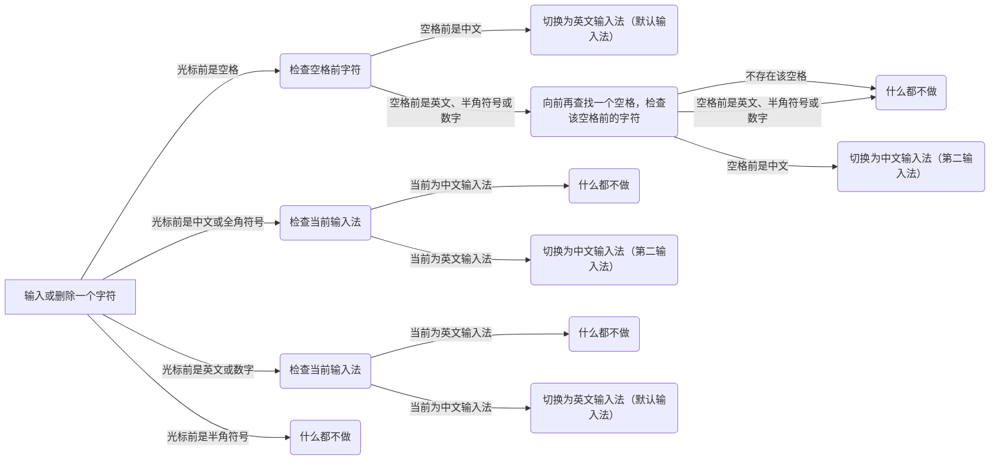

# im-select.nvim

中文/[English](./readme/README.md)

fork 自 [im-select](https://github.com/keaising/im-select.nvim)

在 keaising/im-select.nvim 的基础上，添加了一个用于混合输入的功能，在配置中使用 `hybrid_mode = true` 设置，默认为 `false`，同时需要设置 `default_im_select` 为英文输入法，`second_method_selected` 为你使用的中文输入法，暂不支持三个输入法之间的切换。

保留了原本自动切换输入法的功能，通过 `set_default_events` 和 `set_previous_events` 设置

自动在 NeoVim 中切换输入法

这个插件可以工作在：

- macOS
- Windows and WSL
- Linux
  - Fcitx5
  - Fcitx(only switch between inactive and active)
  - IBus

## DEMO

[DEMO](https://youtu.be/wRJ-rMcvqTk)(youtube)

## 混合输入逻辑



## 1. 安装与检查可执行文件

`im-select.nvim` 使用可执行文件切换输入法

1. 在不同 OS 上安装可执行对应程序
2. 确保 NeoVim 可以读取对应程序

### 1.1 Windows / WSL

#### 安装

请安装 `im-select.exe` 并放入 `PATH`

Download URL: [im-select](https://github.com/daipeihust/im-select)

#### 检查

你可以使用以下命令检查 `im-select` 是否可用

```bash
# find the command
$ where im-select.exe

# Get current im name
$ im-select.exe

# Try to switch to English keyboard
$ im-select.exe 1033
```

或者直接在 NeoVim 中使用以下程序

```bash
:!where im-select.exe

:!im-select.exe 1003
```

### 1.2 macOS

#### 安装

Please install `macism`
请安装 `macism`

Download URL: [macism](https://github.com/laishulu/macism)

#### 检查

在 bash/zsh 中检查

```bash
# find binary
$ which macism

# Get current im name
$ macism
com.apple.keylayout.ABC

# Try to switch to English keyboard
$ macism com.apple.keylayout.ABC
```

在 NeoVim 中检查

```bash
:!which macism
```

### 1.3 Linux

#### 安装

请使用其中一个输入法： Fcitx5/Fcitx/IBus

#### 检查

在 bash/zsh 中检查

**> Fcitx**

```bash
# find
$ which fcitx-remote

# activate IM
$ fcitx-remote -o

# inactivate IM
$ fcitx-remote -c
```

**> Fcitx5**

```bash
# find
$ which fcitx5-remote

# Get current im name
$ fcitx5-remote -n

# Try to switch to English keyboard
$ fcitx5-remote keyboard-us
```

**> IBus**

```bash
# find
$ which ibus

# Get current im name
$ ibus engine

# Try to switch to English keyboard
$ ibus engine xkb:us::eng
```

在 NeoVim 中检查

```bash
# find
:!which fcitx
:!which fcitx5
:!which ibus
```

## 2. 安装插件

极简配置

```lua
{
    "SilverofLight/im-select.nvim",
    config = function()
        require("im_select").setup({})
    end,
}
```

默认配置

```lua
{
    "SilverofLight/im-select.nvim",
    config = function()
        require('im_select').setup({
            -- IM will be set to `default_im_select` in `normal` mode
            -- For Windows/WSL, default: "1033", aka: English US Keyboard
            -- For macOS, default: "com.apple.keylayout.ABC", aka: US
            -- For Linux, default:
            --               "keyboard-us" for Fcitx5
            --               "1" for Fcitx
            --               "xkb:us::eng" for ibus
            -- You can use `im-select` or `fcitx5-remote -n` to get the IM's name
            default_im_select  = "com.apple.keylayout.ABC", -- 你的英文输入法
            second_method_selected = "shuangpin", -- 你的中文输入法（第二输入法）

            -- Can be binary's name, binary's full path, or a table, e.g. 'im-select',
            -- '/usr/local/bin/im-select' for binary without extra arguments,
            -- or { "AIMSwitcher.exe", "--imm" } for binary need extra arguments to work.
            -- For Windows/WSL, default: "im-select.exe"
            -- For macOS, default: "macism"
            -- For Linux, default: "fcitx5-remote" or "fcitx-remote" or "ibus"
            default_command = "im-select.exe",

            -- Restore the default input method state when the following events are triggered
            set_default_events = { "VimEnter", "FocusGained", "InsertLeave", "CmdlineLeave" },

            -- Restore the previous used input method state when the following events
            -- are triggered, if you don't want to restore previous used im in Insert mode,
            -- e.g. deprecated `disable_auto_restore = 1`, just let it empty
            -- as `set_previous_events = {}`
            set_previous_events = { "InsertEnter" },

            -- Show notification about how to install executable binary when binary missed
            keep_quiet_on_no_binary = false,

            -- Async run `default_command` to switch IM or not
            async_switch_im = true,

            -- hybrid_mode
            hybrid_mode = false -- 设置为 true 开启混合输入
        })
    end,
}
```

